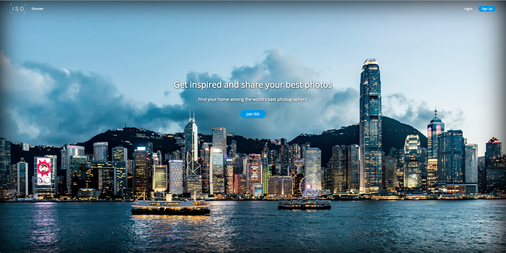

[ISO Live-Demo](https://iso-frame.herokuapp.com/)
ISO is a full-stack single-page app inspired by photo sharing websites like 500px. It's built on Ruby on Rails for the back-end and React/Redux for the front-end to produce a 'RESTful' JSON API.

## Features
- User Authentication with automated demo-login
- User photo uploads
- User ability to follow/unfollow users for a dynamic feed page
- User ability to comment on photos
- Discover page to browse new photos and find new users to follow
- Responsive photo display on various screen sizes via CSS
- Amazon Web Services (AWS) S3 Storage
- Uses PostgreSQL to handle database responsibilities

### User Authentication with automated demo-login
Users can use the demo-login provided to get right into the action.

### User Photo Uploads
Users can upload photos whether for their profile feed, profile photo, or cover photo.

### User ability to follow/unfollow users
Users can follow or unfollow users, which will dynamically change the photos that are appearing on the current user's feed.

### Mobile Responsiveness
ISO's photo gallery is responsive to varying screen sizes. Users can share similar experiences on ISO from the computer or on the mobile devices.

### Future Implementations
I plan to continue adding and revising features to ISO.
Here are some features that I plan on adding in the near future:
- Likes
- Tags
- Infinite scrolling
